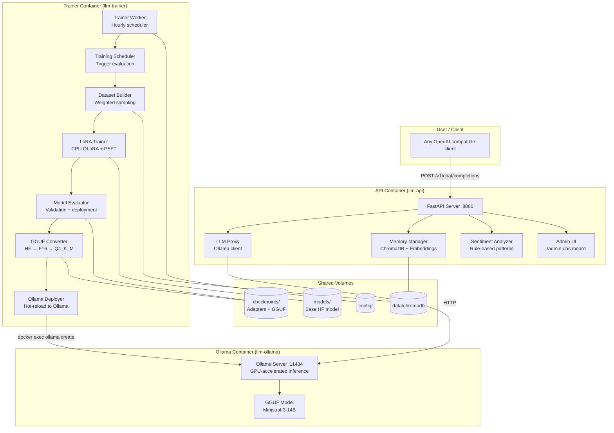
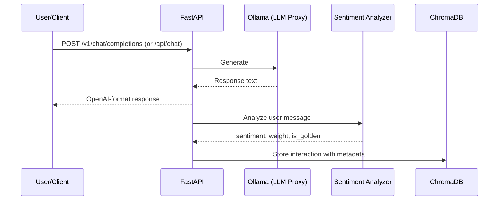
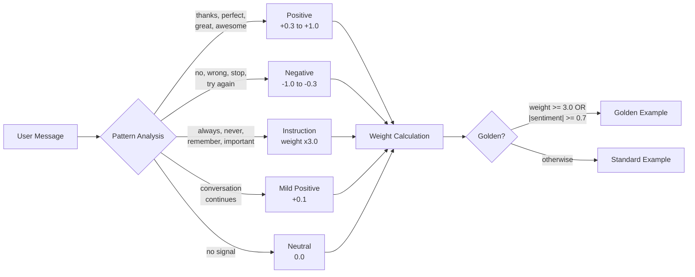
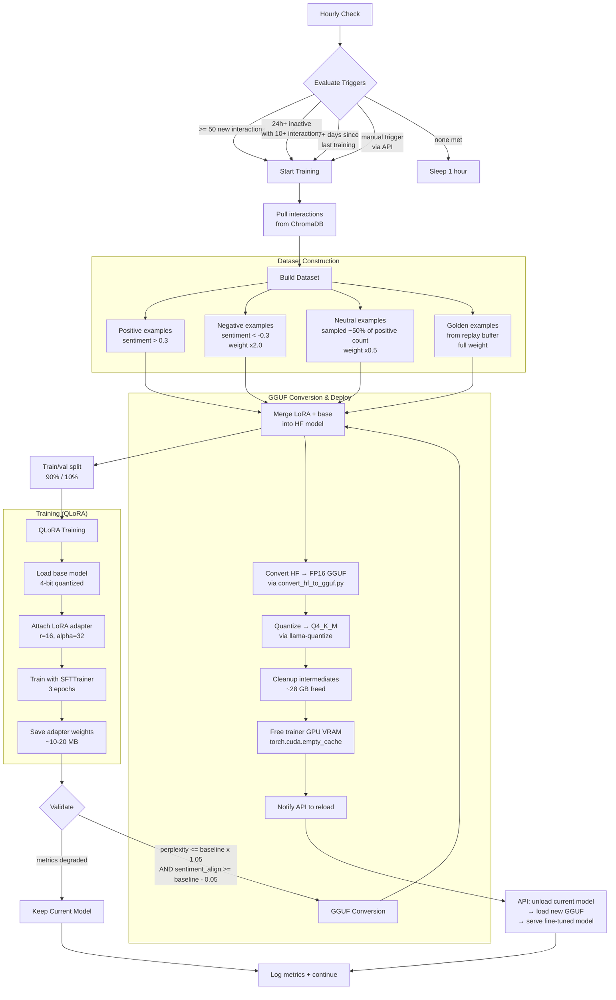
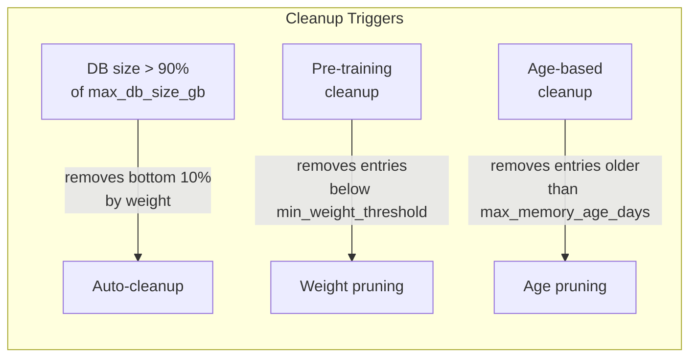
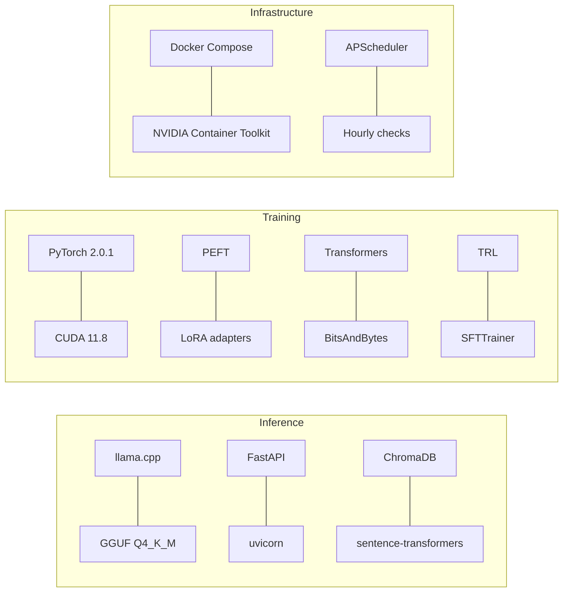

# For Nerds: Technical Breakdown

This document covers the architecture, data flows, training pipeline, and internals of Project RLHFL. If you're looking for setup instructions, see [QUICKSTART.md](QUICKSTART.md). If you want the plain-English overview, see [README.md](README.md).

## System Architecture

The system runs as three Docker containers sharing GPU access, a vector database, and shared volumes for models and checkpoints.



### Container Design

| Container | Base Image | Purpose | GPU Access | Key Dependencies |
|-----------|-----------|---------|------------|------------------|
| `llm-api` | `nvidia/cuda:11.8.0-devel-ubuntu22.04` | Proxies requests to Ollama, stores interactions | Yes (for embeddings) | FastAPI, ChromaDB, sentence-transformers, httpx |
| `llm-trainer` | `nvidia/cuda:11.8.0-devel-ubuntu22.04` | Runs CPU-based training pipeline | No (CPU training) | PyTorch 2.0.1, PEFT, Transformers, BitsAndBytes, gguf |
| `llm-ollama` | `ollama/ollama:latest` | GPU-accelerated GGUF model serving | Yes (for inference) | Ollama, llama.cpp |

All containers share volumes:
- `/checkpoints` - Training outputs, LoRA adapters, and GGUF files
- `/models` - Base HuggingFace model weights
- `/data` - ChromaDB vector database
- `/config` - System configuration

The trainer produces LoRA adapters, merges them with the base model, converts to GGUF format, and deploys to Ollama with zero downtime via hot-reload.

## Inference Flow

Every chat request follows this path:



### RAG (Retrieval-Augmented Generation)

When `rag_enabled: true` (default), the system retrieves the `rag_top_k` most semantically similar past interactions and injects them as context at the start of the prompt. This gives the model access to relevant conversation history without fine-tuning for every interaction.

Embeddings are generated using [sentence-transformers](https://www.sbert.net/) (`all-MiniLM-L6-v2`, 384 dimensions). Similarity search uses cosine distance via ChromaDB.

### Prompt Format

The system uses the [Mistral Instruct](https://docs.mistral.ai/guides/prompting_capabilities/) prompt format:

```
[INST] {system message + RAG context}

{user message} [/INST]
```

## Sentiment Inference

The sentiment analyzer uses pattern matching on the **user's message** (not the model's response) to infer feedback. This is how the system learns without manual labels.



### Sentiment Scoring

| Signal Type | Patterns | Score Range |
|------------|----------|-------------|
| Strong positive | "perfect", "excellent", "exactly" | +0.8 to +1.0 |
| Moderate positive | "thanks", "good", "helpful" | +0.3 to +0.6 |
| Continuation | (user sends another message) | +0.1 |
| Moderate negative | "no", "wrong", "not what I asked" | -0.3 to -0.6 |
| Strong negative | "stop", "terrible", repeated corrections | -0.7 to -1.0 |

### Weight Calculation

Weight determines how much influence an interaction has during training:

```
weight = base_weight
       + sentiment_magnitude * 2.0
       + length_bonus (longer = slightly higher)
       + instruction_boost (3x if contains directives)
```

### Golden Examples

Interactions marked as "golden" are always included in training datasets, acting as a **replay buffer** to prevent [catastrophic forgetting](https://en.wikipedia.org/wiki/Catastrophic_interference). An interaction becomes golden when:

- Weight >= 3.0 (high-value instruction), OR
- |Sentiment| >= 0.7 (strong user signal)

Golden examples are never deleted during auto-cleanup and are stored in a separate ChromaDB collection.

## Training Pipeline

The trainer runs as a background service with an hourly check loop.



### QLoRA Configuration

The system uses [QLoRA](https://arxiv.org/abs/2305.14314) -- quantized LoRA -- to train efficiently on limited VRAM. The base model stays in 4-bit precision while only the small LoRA adapter matrices are trained in full precision.

```
LoRA Config:
  rank (r):        16          # Adapter rank -- controls capacity
  alpha:           32          # Scaling factor (alpha/r = 2x)
  target modules:  q_proj, v_proj, k_proj, o_proj  # Attention layers
  dropout:         0.05
  task type:       CAUSAL_LM

Training Config:
  batch size:      2           # Per-device batch size
  grad accumulation: 4         # Effective batch = 8
  learning rate:   5e-5
  epochs:          3
  warmup steps:    100
  weight decay:    0.01
  max grad norm:   1.0
```

For more on how LoRA works, see the [original paper](https://arxiv.org/abs/2106.09685) or [HuggingFace's PEFT guide](https://huggingface.co/docs/peft/conceptual_guides/adapter#low-rank-adaptation-lora).

### VRAM Usage During Training

| Component | Approximate VRAM |
|-----------|-----------------|
| Base model (4-bit quantized) | ~4-6 GB |
| LoRA adapter (trainable) | ~10 MB |
| Optimizer states | ~4-6 GB |
| Activations + gradients | ~2-4 GB |
| **Total** | **~12-14 GB** |

### Validation and Deployment

After training, the evaluator runs the validation set through the new checkpoint and compares metrics to the current deployed checkpoint:

**Perplexity** -- Measures how "surprised" the model is by the validation data. Lower is better. The system allows up to 5% degradation before rejecting.

**Sentiment alignment** -- Measures whether the model's outputs match the expected sentiment direction from the training data. The system allows up to 0.05 absolute degradation.

Before training begins, the trainer requests the API to **unload its model** (`POST /v1/model/unload`), freeing GPU vRAM so the trainer gets full access to the GPU. The API returns 503 to inference requests during this window.

If both metrics pass, the adapter goes through the **GGUF conversion pipeline**:

1. **Merge**: LoRA adapter is merged into the base HuggingFace model (on CPU to avoid vRAM pressure)
2. **Convert**: Merged model is converted to FP16 GGUF via `convert_hf_to_gguf.py`
3. **Quantize**: FP16 GGUF is quantized to Q4_K_M via `llama-quantize` (~4 GB output)
4. **Cleanup**: Intermediate files (~28 GB) are removed
5. **GPU handoff**: Trainer calls `torch.cuda.empty_cache()` to free all VRAM
6. **Hot reload**: API is notified via HTTP POST; it loads the new GGUF and resumes serving. A background poller (30s interval) acts as a safety net if the HTTP notification fails.

If validation fails or conversion errors occur, the trainer tells the API to reload its previous model. If the new GGUF fails to load, the API automatically rolls back to the previous model.

### Checkpoint Structure

```
volumes/checkpoints/
├── checkpoint_20260206_225455/
│   ├── adapter/
│   │   ├── adapter_config.json     # LoRA configuration
│   │   └── adapter_model.bin       # Trained weights (~10-20 MB)
│   ├── training_metadata.json      # Training run details
│   └── checkpoint-*/               # HuggingFace trainer state
└── checkpoint_20260206_225455_metadata.json  # Deployment metadata
```

Each metadata file tracks:
```json
{
    "checkpoint_id": "checkpoint_20260206_225455",
    "timestamp": "2026-02-06T22:54:55",
    "metrics": {
        "perplexity": 2.34,
        "sentiment_alignment": 0.85
    },
    "parent_checkpoint": "checkpoint_20260205_120000",
    "training_samples": 156,
    "deployed": true,
    "can_rollback": true,
    "gguf_model_path": "/models/model-checkpoint_20260206_225455.Q4_K_M.gguf"
}
```

## Memory Management

### Interaction Storage

Every interaction is stored in ChromaDB with:

| Field | Type | Description |
|-------|------|-------------|
| `id` | string | `conv_{conversation_id}_{timestamp}` |
| `conversation_id` | string | Groups messages from the same session |
| `user_message` | string | The user's input text |
| `assistant_response` | string | The model's generated response |
| `sentiment` | float | -1.0 to +1.0 |
| `weight` | float | Importance multiplier for training |
| `is_golden` | bool | Whether this is a golden example |
| `timestamp` | ISO 8601 | When the interaction occurred |
| `embedding` | float[384] | Semantic embedding vector |

### Auto-Cleanup

The system prevents unbounded database growth with three cleanup mechanisms:



Golden examples are **never** removed by any cleanup mechanism.

### Admin Dashboard

The web UI at `/admin` provides:

- **Model & Training Controls** -- current model status, trigger training, rollback to any checkpoint, revert to base model
- **Checkpoint table** -- all training checkpoints with metrics, GGUF status, and one-click rollback
- Training statistics (interaction counts, time since last training)
- Training progress charts (loss, evaluation loss, samples over time)
- Sentiment distribution (positive / negative / neutral)
- Memory browser with filtering and pagination
- Golden example management (toggle any interaction)
- Database size monitoring with manual cleanup triggers
- Recent API request log for debugging

## API Reference

### Endpoints

| Method | Path | Description |
|--------|------|-------------|
| `GET` | `/health` | System health status (includes reload state) |
| `GET` | `/v1/models` | List available models |
| `POST` | `/v1/chat/completions` | Chat completion (streaming + non-streaming) |
| `POST` | `/v1/training/trigger` | Manually trigger a training run |
| `GET` | `/v1/training/stats` | Training statistics |
| `POST` | `/v1/model/unload` | Unload model to free GPU vRAM (pre-training) |
| `POST` | `/v1/model/reload` | Hot-reload model from a new GGUF file |
| `GET` | `/admin` | Admin dashboard (HTML) |
| `GET` | `/admin/api/stats` | System statistics (JSON) |
| `GET` | `/admin/api/model/status` | Current model status, checkpoint, metrics |
| `POST` | `/admin/api/training/trigger` | Trigger training from admin UI |
| `POST` | `/admin/api/model/rollback` | Rollback to a specific checkpoint |
| `POST` | `/admin/api/model/reload-base` | Revert to base model (undo fine-tuning) |
| `GET` | `/admin/api/memories` | Paginated interaction list |
| `GET` | `/admin/api/memories/{id}` | Interaction detail |
| `PUT` | `/admin/api/memories/{id}` | Update interaction metadata |
| `DELETE` | `/admin/api/memories/{id}` | Delete an interaction |
| `POST` | `/admin/api/memories/{id}/toggle-golden` | Toggle golden status |
| `GET` | `/admin/api/checkpoints` | List training checkpoints |
| `GET` | `/admin/api/training/history` | Training metrics over time |
| `GET` | `/admin/api/database/info` | Database size and stats |
| `POST` | `/admin/api/database/cleanup/age` | Age-based cleanup |
| `POST` | `/admin/api/database/cleanup/weight` | Weight-based cleanup |
| `POST` | `/admin/api/database/cleanup/lowest` | Remove lowest-weight entries |

### Chat Completion Request

```json
{
    "model": "mistral-7b-instruct",
    "messages": [
        {"role": "system", "content": "You are a helpful assistant."},
        {"role": "user", "content": "Hello!"}
    ],
    "temperature": 0.7,
    "top_p": 0.9,
    "max_tokens": 4096,
    "stream": false,
    "user": "optional-conversation-id"
}
```

### Chat Completion Response

```json
{
    "id": "chatcmpl-abc123",
    "object": "chat.completion",
    "created": 1707264000,
    "model": "mistral-7b-instruct",
    "choices": [
        {
            "index": 0,
            "message": {
                "role": "assistant",
                "content": "Hello! How can I help you today?"
            },
            "finish_reason": "stop"
        }
    ],
    "usage": {
        "prompt_tokens": 12,
        "completion_tokens": 9,
        "total_tokens": 21
    }
}
```

### OpenAI Feature Support

| Feature | Supported |
|---------|-----------|
| `messages` (system, user, assistant, tool) | Yes |
| `temperature`, `top_p`, `max_tokens` | Yes |
| `stream` (SSE) | Yes |
| `user` (used as conversation ID) | Yes |
| `tools` / `tool_choice` | Yes |
| `response_format` (JSON mode) | No |
| `n` (multiple completions) | No |
| `logprobs` | No |

## Tech Stack Summary



| Layer | Technology | Version | Why |
|-------|-----------|---------|-----|
| Inference engine | llama.cpp | via llama-cpp-python | Fast GGUF inference with CUDA support |
| Base model | Mistral 7B Instruct v0.3 | Q4_K_M quantization | Best performance/size ratio at 7B scale |
| Web framework | FastAPI | 0.104.1 | Async, OpenAPI docs, Pydantic validation |
| Vector database | ChromaDB | 0.4.18 | Embedded, no server, persistent, cosine search |
| Embeddings | sentence-transformers | 2.3.1 | `all-MiniLM-L6-v2`, fast 384-dim embeddings |
| Training framework | PyTorch | 2.0.1 | Last version with CUDA 6.1 support |
| Adapter training | PEFT | 0.7.1 | LoRA / QLoRA with HuggingFace integration |
| Quantization | BitsAndBytes | 0.41.3 | 4-bit NormalFloat quantization |
| Training loop | TRL | 0.7.4 | SFTTrainer for supervised fine-tuning |
| Model loading | Transformers | 4.36.0 | HuggingFace model hub, tokenizers, configs |
| Scheduling | APScheduler | 3.10.4 | Background interval-based job scheduling |
| Config | Pydantic + YAML | 2.5.0 | Typed config with validation and env var support |

## Known Limitations

1. **Single GPU** -- Inference and training share the same GPU. Training blocks inference while running. During model hot-reload (~5-15s), requests receive HTTP 503.
2. **Rule-based sentiment** -- Pattern matching is simpler than ML-based sentiment analysis; nuanced feedback may be misclassified.
3. **No multi-turn training context** -- Each interaction is trained as an independent sample, not as part of a conversation chain.

## Further Reading

- [LoRA: Low-Rank Adaptation of Large Language Models](https://arxiv.org/abs/2106.09685) -- The original LoRA paper
- [QLoRA: Efficient Finetuning of Quantized LLMs](https://arxiv.org/abs/2305.14314) -- 4-bit quantized training
- [RLHF overview](https://huggingface.co/blog/rlhf) -- Reinforcement Learning from Human Feedback explained
- [PEFT documentation](https://huggingface.co/docs/peft) -- HuggingFace's adapter training library
- [ChromaDB docs](https://docs.trychroma.com/) -- The vector database used for memory
- [Mistral AI documentation](https://docs.mistral.ai/) -- The base model family
- [llama.cpp](https://github.com/ggerganov/llama.cpp) -- The C++ inference engine
